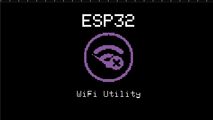
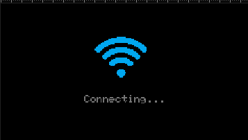
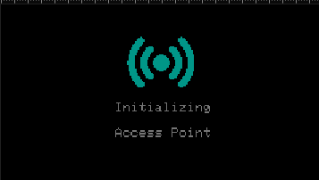
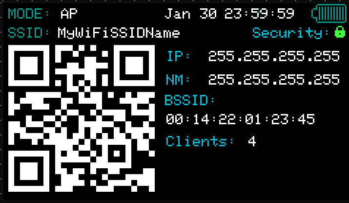
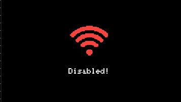

# TFT Display UI Redesign (v5.2.0)

**Version:** 5.2.0  
**Last Updated:** January 16, 2026  
**Design Reference:** [Lopaka UI Editor](https://lopaka.app/editor/23371/50884)

---

## 📋 Table of Contents

1. [Overview](#overview)
2. [Design Philosophy](#design-philosophy)
3. [Welcome Screen](#welcome-screen)
4. [Color-Coded Status System](#color-coded-status-system)
5. [Screen Modes](#screen-modes)
6. [Modular Architecture](#modular-architecture)
7. [Technical Implementation](#technical-implementation)
8. [UI Design Assets](#ui-design-assets)
9. [Memory Usage](#memory-usage)
10. [User Experience](#user-experience)

---

## Overview

Version 5.2.0 introduces a complete **TFT display UI redesign** with professional branding, intuitive color-coded status indicators, and a modular architecture that eliminates code duplication while improving maintainability.

### Key Improvements

- ✨ **Branded Welcome Screen** - Professional ESP32 WiFi Utility branding on startup
- 🎨 **Color-Coded Status** - Intuitive visual feedback (Blue/Green/Red/Yellow)
- 🏗️ **Modular Architecture** - Single `displayWiFiStatusScreen()` function eliminates duplication
- 📱 **8 Display Modes** - Complete coverage of all WiFi states
- 🎯 **Centered Layouts** - Improved visual balance and readability
- 🔧 **Queue-Based Updates** - Non-blocking FreeRTOS messaging system

---

## Design Philosophy

### Visual Consistency
All status screens follow a unified design language:
- **Consistent Icon Size**: 50x50 WiFi symbol across all screens
- **Centered Layouts**: Icons and text vertically centered for visual balance
- **Color Psychology**: Intuitive color choices matching user expectations
- **Clear Typography**: Size 1 font for readability on small displays

### User Experience Goals
1. **Instant Recognition** - Users know device state at a glance
2. **Visual Feedback** - Every state change reflected on display
3. **Professional Appearance** - Branded experience from boot
4. **Minimal Text** - Icons and colors communicate status efficiently

---

## Welcome Screen

<p align="center">
  
</p>

### Design
- **ESP32 Logo**: 60x60 pixel bitmap in purple (0x82F4)
- **Title**: "ESP32" in size 2 font
- **Subtitle**: "WiFi Utility" in size 1 font
- **Duration**: 2-second display on device boot
- **Purpose**: Professional branding and device identification

### Implementation
```cpp
void displayWelcomeScreen() {
    tft.fillScreen(ST77XX_BLACK);
    
    // Draw ESP32 logo (60x60) in purple
    int logoX = (TFT_WIDTH - 60) / 2;
    int logoY = 20;
    tft.drawBitmap(logoX, logoY, image_esp32_logo_bits, 60, 60, 0x82F4);
    
    // Title and subtitle
    tft.setTextColor(ST77XX_WHITE);
    tft.setCursor(52, 90);
    tft.setTextSize(2);
    tft.print("ESP32");
    
    tft.setCursor(38, 110);
    tft.setTextSize(1);
    tft.print("WiFi Utility");
}
```

**Triggered**: Once during `setup()` after TFT initialization

---

## Color-Coded Status System

### Color Palette

| Color | Hex Code | RGB565 | Status | Psychology |
|-------|----------|--------|--------|------------|
| 🔵 **Blue** | #5555EE | 0x55E | Connecting/Idle | Calm, processing, waiting |
| 🟢 **Green** | #00FF00 | 0x07E0 | Connected/Active | Success, go, ready |
| 🔴 **Red** | #FF2266 | 0xF206 | Disabled/Error | Stop, warning, offline |
| 🟡 **Yellow** | #FFFF00 | 0xFFE0 | Idle (no text) | Standby, waiting, neutral |
| 🟣 **Purple** | #8855FF | 0x82F4 | Branding | Premium, technology |

### Text Colors
- **Primary Text**: Light gray (0x73AE) for main labels
- **Secondary Text**: Light gray (0xEF7D) for status messages
- **Background**: Black (ST77XX_BLACK)

### Status Mapping

| WiFi State | Icon Color | Text | Screen Mode |
|------------|------------|------|-------------|
| Starting | Purple | "ESP32 WiFi Utility" | `TFT_MODE_OFF` → Welcome |
| AP Initializing | Green | "Initializing Access Point" | `TFT_MODE_CONNECTING` |
| AP Active | Green | Full AP info + QR code | `TFT_MODE_AP` |
| Station Connecting | Blue | "Station Mode / Connecting..." | `TFT_MODE_CONNECTING` |
| Station Connected | Green → Station | "Connected!" → Full info | `TFT_MODE_STATION` |
| Station Idle (text) | Blue | "Station Mode / Idle" | `TFT_MODE_IDLE` |
| Mode Idle (symbol) | Yellow | (no text) | `TFT_MODE_IDLE_YELLOW` |
| WiFi Disabled | Red | "Disabled!" | `TFT_MODE_DISABLED` |

---

## Screen Modes

### 1. Welcome Screen (`displayWelcomeScreen()`)
**When**: Device boot after TFT initialization  
**Display**:
- Purple ESP32 logo (60x60)
- "ESP32" title
- "WiFi Utility" subtitle
- Black background

**Duration**: 2 seconds

---

### 2. Connecting Screen (Blue)
<p align="center">
  
</p>

**Mode**: `TFT_MODE_CONNECTING`  
**When**: Initiating WiFi connection  
**Display**:
- Blue WiFi icon (50x50)
- "Station Mode" (line 1)
- "Connecting..." (line 2)
- Vertically centered

**Code**:
```cpp
void displayStationConnectingScreen() {
    displayWiFiStatusScreen(0x55E, 0x73AE, "Station Mode", "Connecting...");
}
```

---

### 3. Connected Confirmation (Green)
**Mode**: `TFT_MODE_STATION` (1-second confirmation)  
**When**: WiFi connection successful  
**Display**:
- Green WiFi icon (50x50)
- "Connected!" (centered)
- Black background

**Duration**: 1 second, then transitions to full station info

---

### 4. Station Mode Info
**Mode**: `TFT_MODE_STATION` (full display)  
**When**: Connected and stable  
**Display**:
- Blue "Station Mode" header
- Connected network SSID
- Local IP address
- Signal strength (RSSI) with quality bar
- Color-coded signal quality (Green/Yellow/Red)

---

### 5. Station Idle (Blue, with text)
**Mode**: `TFT_MODE_IDLE`  
**When**: `startStationMode()` called without connection  
**Display**:
- Blue WiFi icon (50x50)
- "Station Mode" (line 1)
- "Idle" (line 2)
- Vertically centered

**Triggered**: Starting station mode without connecting to network

---

### 6. Mode Idle (Yellow, no text)
**Mode**: `TFT_MODE_IDLE_YELLOW`  
**When**: `mode idle` command executed  
**Display**:
- Yellow WiFi icon (50x50)
- No text
- Icon vertically centered at y=42
- Black background

**Code**:
```cpp
case TFT_MODE_IDLE_YELLOW:
    displayWiFiStatusScreen(0xFFE0, 0x73AE, nullptr, nullptr);
    break;
```

---

### 7. Initializing Access Point (Green)
<p align="center">
  
</p>

**Mode**: `TFT_MODE_CONNECTING` (used for AP initialization)  
**When**: Starting Access Point mode  
**Display**:
- Green WiFi icon (50x50)
- "Initializing Access Point" (centered)
- Vertically centered

**Duration**: Brief, transitions to full AP display

---

### 8. Access Point Mode
<p align="center">
  
</p>

**Mode**: `TFT_MODE_AP`  
**When**: AP active with clients connected  
**Display**:
- Green "AP Mode" header
- Network SSID
- Network password
- AP IP address
- QR code for mobile connection
- Client count
- Battery status
- Current time

**Full Information Display**: Comprehensive AP status

---

### 9. Disabled Screen (Red)
<p align="center">
  
</p>

**Mode**: `TFT_MODE_DISABLED`  
**When**: `mode off` command executed  
**Display**:
- Red WiFi icon (50x50)
- "Disabled!" (centered)
- Vertically centered

**Code**:
```cpp
void displayWiFiDisabledScreen() {
    displayWiFiStatusScreen(0xF206, 0xEF7D, "Disabled!", nullptr);
}
```

---

## Modular Architecture

### Core Function: `displayWiFiStatusScreen()`

The redesign introduces a single modular function that handles all WiFi status screens, eliminating code duplication across 6+ similar display functions.

#### Function Signature
```cpp
void displayWiFiStatusScreen(uint16_t iconColor, uint16_t textColor, 
                              const char* line1, const char* line2)
```

#### Parameters
- `iconColor`: RGB565 color for WiFi icon (blue/green/red/yellow)
- `textColor`: RGB565 color for text labels
- `line1`: First line of text (optional, pass `nullptr` for no text)
- `line2`: Second line of text (optional, pass `nullptr` for single line)

#### Behavior
- **No Text**: Icon centered vertically at y=42
- **One Line**: Icon at y=26, text below
- **Two Lines**: Icon at y=22, text below

#### Implementation
```cpp
void displayWiFiStatusScreen(uint16_t iconColor, uint16_t textColor, 
                              const char* line1, const char* line2) {
    tft.fillScreen(ST77XX_BLACK);
    
    // Calculate icon position based on text presence
    int iconX = (TFT_WIDTH - 50) / 2;
    int iconY;
    
    if (line1 == nullptr || strlen(line1) == 0) {
        iconY = 42;  // Centered when no text
    } else if (line2 == nullptr || strlen(line2) == 0) {
        iconY = 26;  // Higher when one line of text
    } else {
        iconY = 22;  // Higher when two lines of text
    }
    
    // Draw WiFi icon
    tft.drawBitmap(iconX, iconY, image_wifi_1_bits, 50, 50, iconColor);
    
    // Draw text if provided
    tft.setTextColor(textColor);
    tft.setTextSize(1);
    
    if (line1 != nullptr && strlen(line1) > 0) {
        int textX = (TFT_WIDTH - (strlen(line1) * 6)) / 2;
        int textY = iconY + 60;
        tft.setCursor(textX, textY);
        tft.print(line1);
    }
    
    if (line2 != nullptr && strlen(line2) > 0) {
        int textX = (TFT_WIDTH - (strlen(line2) * 6)) / 2;
        int textY = iconY + 75;
        tft.setCursor(textX, textY);
        tft.print(line2);
    }
}
```

### Refactored Functions

All status screens now use the modular function:

```cpp
// Connecting screen
void displayStationConnectingScreen() {
    displayWiFiStatusScreen(0x55E, 0x73AE, "Station Mode", "Connecting...");
}

// Station idle with text
void displayStationIdleScreen() {
    displayWiFiStatusScreen(0x55E, 0x73AE, "Station Mode", "Idle");
}

// Disabled screen
void displayWiFiDisabledScreen() {
    displayWiFiStatusScreen(0xF206, 0xEF7D, "Disabled!", nullptr);
}

// Mode idle (yellow, no text)
// In tftDisplayTask():
case TFT_MODE_IDLE_YELLOW:
    displayWiFiStatusScreen(0xFFE0, 0x73AE, nullptr, nullptr);
    break;
```

### Benefits

1. **Code Reduction**: ~100 lines eliminated across multiple functions
2. **Consistency**: All screens have identical layout and behavior
3. **Maintainability**: Single function to update for layout changes
4. **Flexibility**: Easy to add new status screens
5. **Readability**: Clear, declarative screen definitions

---

## Technical Implementation

### Queue-Based Updates

All TFT updates use FreeRTOS queue messaging for non-blocking operation:

```cpp
bool sendTFTIdle() {
    if (tftQueue == NULL) return false;
    TFTMessage msg;
    msg.mode = TFT_MODE_IDLE;
    return xQueueSend(tftQueue, &msg, 0) == pdTRUE;
}

bool sendTFTIdleYellow() {
    if (tftQueue == NULL) return false;
    TFTMessage msg;
    msg.mode = TFT_MODE_IDLE_YELLOW;
    return xQueueSend(tftQueue, &msg, 0) == pdTRUE;
}

bool sendTFTDisabled() {
    if (tftQueue == NULL) return false;
    TFTMessage msg;
    msg.mode = TFT_MODE_DISABLED;
    return xQueueSend(tftQueue, &msg, 0) == pdTRUE;
}
```

### Display Task

The TFT display task handles mode switching:

```cpp
void tftDisplayTask(void *parameter) {
    TFTMessage msg;
    
    while (true) {
        if (xQueueReceive(tftQueue, &msg, portMAX_DELAY) == pdTRUE) {
            switch (msg.mode) {
                case TFT_MODE_CONNECTING:
                    displayStationConnectingScreen();
                    break;
                    
                case TFT_MODE_IDLE:
                    displayStationIdleScreen();
                    break;
                    
                case TFT_MODE_IDLE_YELLOW:
                    displayWiFiStatusScreen(0xFFE0, 0x73AE, nullptr, nullptr);
                    break;
                    
                case TFT_MODE_DISABLED:
                    displayWiFiDisabledScreen();
                    break;
                    
                case TFT_MODE_AP:
                    displayAPMode(/* AP info */);
                    break;
                    
                case TFT_MODE_STATION:
                    displayStationMode(/* station info */);
                    break;
                    
                // ... other modes
            }
        }
    }
}
```

### Architecture Cleanup

**Before** (Poor separation):
```cpp
// command_interface.cpp
#include "tft_display.h"  // Direct TFT dependency

void handleModeOff() {
    stopWiFi();
    displayWiFiDisabledScreen();  // Direct call
}
```

**After** (Clean separation):
```cpp
// command_interface.cpp
// No TFT includes

void handleModeOff() {
    requestStopWiFi();  // WiFi task handles TFT
}

// wifi_task.cpp
case WIFI_CMD_STOP:
    sendTFTDisabled();  // WiFi task updates TFT
    stopWiFi();
    break;
```

**Benefits**:
- Command interface has no TFT dependencies
- WiFi task orchestrates both WiFi and TFT operations
- Single responsibility principle maintained
- Easier testing and maintenance

---

## UI Design Assets

### Bitmap Resources

#### WiFi Icon (50x50 pixels)
- **File**: `image_wifi_1_bits`
- **Size**: 313 bytes (50×50÷8 + overhead)
- **Format**: 1-bit XBM bitmap
- **Usage**: All status screens

#### ESP32 Logo (60x60 pixels)
- **File**: `image_esp32_logo_bits`
- **Size**: 450 bytes (60×60÷8)
- **Format**: 1-bit XBM bitmap
- **Usage**: Welcome screen only

### Design Tool

All UI designs created using **[Lopaka](https://lopaka.app/)**:
- **Project URL**: [https://lopaka.app/editor/23371/50884](https://lopaka.app/editor/23371/50884)
- **Editor Features**:
  - Visual bitmap editor
  - XBM format export
  - Preview on virtual display
  - Grid-based layout tools

### Creating New Icons

1. Visit the [Lopaka Editor](https://lopaka.app/editor/23371/50884)
2. Design your icon in the visual editor
3. Export as XBM format
4. Copy array definition to `tft_display.cpp`
5. Add bitmap rendering call in display function

**Example Export**:
```cpp
static const unsigned char image_wifi_1_bits[] PROGMEM = {
  0x00, 0x00, 0x00, 0x00, 0x00, 0x00, 0x00, 0x00, 0x00, 0x00, 0x00, 0x00,
  0x00, 0x00, 0x00, 0x00, 0x00, 0x00, 0x00, 0x00, 0x00, 0x00, 0x00, 0x00,
  // ... bitmap data ...
};
```

---

## Memory Usage

### Flash Memory
- **Total Flash**: 1,441,792 bytes (100%)
- **Used**: 1,225,857 bytes (85.0%)
- **TFT Display Code**: ~8KB
- **WiFi Icon Bitmap**: 313 bytes
- **ESP32 Logo Bitmap**: 450 bytes
- **Total Bitmaps**: 763 bytes

### RAM Usage
- **Total RAM**: 327,680 bytes (100%)
- **Used**: 53,592 bytes (16.4%)
- **TFT Task Stack**: 4,096 bytes
- **TFT Queue**: 5 messages × 72 bytes = 360 bytes
- **Display Buffers**: Minimal (no frame buffer)

### Memory Efficiency

**Before Refactoring** (Duplicated code):
- 6 separate display functions
- ~150 lines of duplicated code
- Larger flash footprint

**After Refactoring** (Modular):
- 1 core function + 3 wrapper functions
- ~50 lines total
- Reduced flash usage
- Better cache utilization

---

## User Experience

### Boot Sequence

1. **Welcome Screen** (2 seconds)
   - Purple ESP32 logo
   - "ESP32 WiFi Utility" branding
   - Professional first impression

2. **Mode Selection**
   - Checks for saved AP config → Green "Initializing Access Point"
   - Checks for saved Station config → Blue "Station Mode / Connecting..."
   - No saved config → Yellow idle symbol

### State Transitions

#### AP Mode Flow
```
Welcome → "Initializing Access Point" (green) → Full AP display with QR
```

#### Station Mode Flow
```
Welcome → "Station Mode / Connecting..." (blue) → "Connected!" (green, 1s) → Full station info
```

#### Idle Mode Flow
```
Welcome → Yellow WiFi symbol (no text)
```

#### Disabled Flow
```
Any state → "Disabled!" (red)
```

### Visual Feedback

Users can instantly identify device state:
- **Blue WiFi** = Working on connection
- **Green WiFi** = Success / Active
- **Red WiFi** = Disabled / Error
- **Yellow WiFi** = Waiting / Idle
- **Purple Logo** = Starting up

### Accessibility

- **High Contrast**: All icons and text on black background
- **Large Icons**: 50×50 pixels for visibility
- **Color + Text**: Status conveyed through both color and text
- **Consistent Layout**: Predictable element positioning
- **Minimal Text**: Easy to read on small display

---

## Comparison: Before vs After

### Before (v5.1.0)

**Issues**:
- ❌ No welcome screen (generic "WiFi Tool Starting..." text)
- ❌ Inconsistent status displays
- ❌ Code duplication across 6+ functions
- ❌ No "mode idle" visual feedback
- ❌ No disabled screen
- ❌ TFT dependencies in command interface
- ❌ Static functions preventing external calls

**Code Example**:
```cpp
void displayStationConnectingScreen() {
    tft.fillScreen(ST77XX_BLACK);
    int iconX = (TFT_WIDTH - 50) / 2;
    int iconY = 22;
    tft.drawBitmap(iconX, iconY, image_wifi_1_bits, 50, 50, 0x55E);
    tft.setTextColor(0x73AE);
    tft.setTextSize(1);
    // ... 20 more lines ...
}

void displayWiFiDisabledScreen() {
    // Didn't exist - missing functionality
}
```

### After (v5.2.0)

**Improvements**:
- ✅ Professional branded welcome screen
- ✅ Complete color-coded status system
- ✅ Single modular function eliminates duplication
- ✅ Yellow WiFi symbol for idle mode
- ✅ Red disabled screen
- ✅ Clean architecture (no TFT in command interface)
- ✅ All functions properly accessible

**Code Example**:
```cpp
void displayWelcomeScreen() {
    tft.fillScreen(ST77XX_BLACK);
    tft.drawBitmap(logoX, logoY, image_esp32_logo_bits, 60, 60, 0x82F4);
    // ... ESP32 branding ...
}

void displayStationConnectingScreen() {
    displayWiFiStatusScreen(0x55E, 0x73AE, "Station Mode", "Connecting...");
}

void displayWiFiDisabledScreen() {
    displayWiFiStatusScreen(0xF206, 0xEF7D, "Disabled!", nullptr);
}
```

**Lines of Code**:
- **Before**: ~180 lines across 6 functions
- **After**: ~80 lines (1 core function + wrappers + welcome screen)
- **Reduction**: 55% code reduction

---

## Future Enhancements

### Potential Improvements

1. **Animation**
   - Connecting animation (spinning/pulsing icon)
   - Smooth transitions between screens
   - Progress indicators

2. **Additional Icons**
   - Warning icon for weak signal
   - Lock icon for secured networks
   - Cloud icon for internet connectivity

3. **Theme Support**
   - Light/dark mode toggle
   - Custom color schemes
   - User-configurable colors

4. **Touch Support**
   - Tap to cycle information screens
   - Swipe gestures for mode switching
   - Interactive buttons

5. **Battery Enhancement**
   - Low battery warning screen
   - Charging indicator animation
   - Power saving mode indication

---

## References

- **Design Tool**: [Lopaka UI Editor - ESP32 WiFi Utility Project](https://lopaka.app/editor/23371/50884)
- **Architecture**: [TFT Task Architecture](technical/TFT_TASK_ARCHITECTURE.md)
- **API Reference**: [TFT Display Header](../lib/TFTDisplay/tft_display.h)
- **Implementation**: [TFT Display Source](../lib/TFTDisplay/tft_display.cpp)
- **Main README**: [v5.2.0 Release Notes](../README.md#-whats-new-in-v520)

---

## Changelog

### v5.2.0 (January 16, 2026)
- ✨ Added branded welcome screen with ESP32 logo
- ✨ Implemented color-coded status system (blue/green/red/yellow)
- ✨ Created modular `displayWiFiStatusScreen()` function
- ✨ Added yellow WiFi symbol for idle mode
- ✨ Added red disabled screen
- 🏗️ Refactored architecture: removed TFT from command interface
- 🐛 Fixed static function visibility issues
- 📝 Created comprehensive UI documentation
- 🎨 Published designs to Lopaka editor

---

**Author**: ESP32 WiFi Utility Team  
**License**: MIT  
**Last Updated**: January 16, 2026
